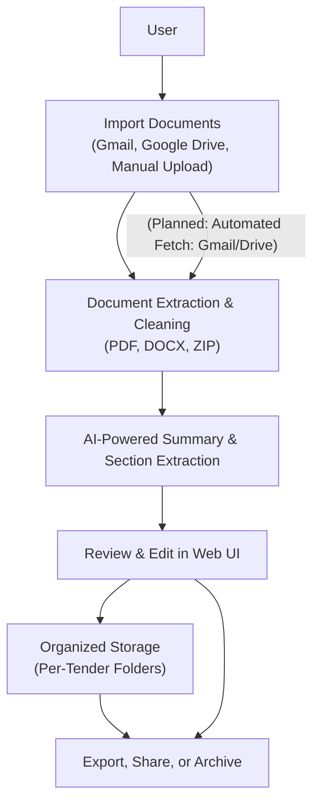
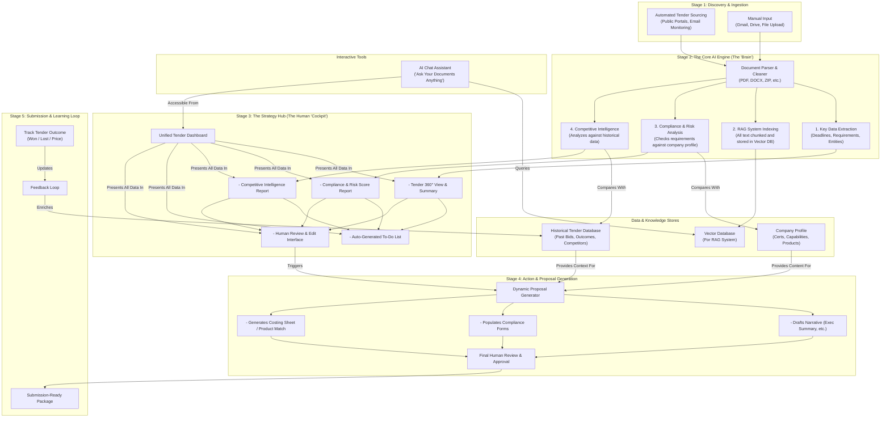

# Automated Tender Processing Platform

## The Problem

Processing public tenders manually is a nightmare: every week, organizations receive dozens of complex documents (PDFs, DOCXs, ZIPs) from various sources. Staff must download, extract, read, and summarize hundreds of pages, then organize everything into folders, track deadlines, and ensure compliance. This process is slow, error-prone, and makes it easy to miss critical details or deadlines—costing time, money, and peace of mind.

## The Solution

**Our platform** automates the entire tender workflow. It fetches documents from email or Google Drive(for this project), extracts and cleans their contents, and uses AI to generate structured summaries. With a modern web interface, you can browse, review, and edit tenders in minutes—not hours. No more manual sorting, no more missed deadlines, and no more copy-pasting between files.

---

## 🚀 Live Demo / Video

- **Live Demo:** in Preparaion

---

## ✨ Key Features & Screenshots

- **Automated Document Import**
  - Fetch tenders from Gmail or Google Drive with one click.
  - __
- **AI-Powered Summaries**
  - Instantly generate structured summaries with sections like “Product Specs”, “Exclusions”, “Special Conditions”, and “Summary”.
  - __
- **File Navigation & Preview**
  - Browse all files (PDF, DOCX, TXT) for each tender in a clean sidebar.
  - __
- **Editable Notes**
  - Add and save your own notes for each tender, right in the web UI.
  - __
- **Timeline View**
  - See all upcoming tenders in a timeline, with deadlines and quick navigation.
  - __
- **(Planned) AI Chat**
  - Chat with an AI about the tender’s requirements and documents. _(Coming soon)_
- **(Planned) Cloud & Database**
  - PostgreSQL integration and cloud deployment for team access and reliability.

---

## 🗺️ How It Works

---

## 🛠️ Technology Stack

- **Frontend:** React (with Tailwind CSS)
- **Backend:** Python (Flask)
- **AI & NLP:** OpenAI API (or similar, for summaries)
- **Storage:** Local file system (current), PostgreSQL (planned)
- **Integrations:** Google Drive, Gmail, (current, fetching tenders data)
- **Deployment:** Local (current), Vercel/Render (planned)

---

## 🧭 My Process & Learnings

I started by identifying the biggest bottleneck: manual data entry and document sorting. To solve this, I prioritized building an automated import and extraction pipeline. The next challenge was generating clear, actionable summaries from messy, unstructured documents—so I integrated AI to extract and organize key sections. One major challenge was handling the wide variety of document formats and inconsistent data; I solved this by building robust extraction and cleaning routines, and by letting users edit and annotate summaries directly in the web interface. Throughout, I focused on making the UI intuitive and the workflow as automated as possible.
---

## ✨ Ideal scenario

The "Outcome-Focused" Narrative

Our vision is to create a "zero-effort" tender processing system that transforms a complex, manual task into a strategic advantage. Imagine a world where your business no longer hunts for opportunities; they are delivered to you. The system proactively identifies and qualifies high-potential tenders perfectly matched to your company's profile. Before you even see it, the platform has already parsed every document, clarified ambiguities with the issuing authority via automated requests, and presented a crystal-clear summary.
It doesn't just show you the tender; it prepares your victory. The platform instantly generates a draft proposal, complete with matching product suggestions from your catalog and a preliminary cost-benefit analysis. A dynamic to-do list flags the few critical items requiring human expertise, while an intelligent AI chat assistant stands ready to recall any piece of information from thousands of pages of documents instantly. The final step for a human is simple: review, approve, and submit a winning bid with confidence and speed. We're not just automating paperwork, we're engineering wins.

---

The "Intelligent Partner" Narrative

We envision a future where applying for tenders is as simple as having a conversation with an expert partner. Our platform acts as that partner. It begins by curating a list of ideal tenders, saving you from the noise. For each opportunity, it provides a "360-Degree View," highlighting key requirements, flagging missing details, and even auto-generating clarification questions for the tender issuer.
The core of the experience is an AI-powered "Deal Room." Here, the system suggests optimal product pairings, calculates project costs, and outlines a clear path to submission. A collaborative to-do list ensures every team member knows their task, from verifying product specs to confirming pricing. The backend RAG system eliminates the need for manual document searches—just ask, "What are the specific insurance requirements?" and get an instant, cited answer. The platform culminates in a perfectly prepared, pre-verified application package, turning a week of work into a few hours of strategic review.

Idea 1: The "Competitive Intelligence" Module Concept: 

The system doesn't just analyze the tender; it analyzes the competition. Using historical public tender data, it could predict:
Likely Bidders: "Companies X and Y have bid on 80% of similar tenders in this region."
Winning Price Analysis: "Tenders of this type typically win with a bid between $1.2M and $1.4M. Bids over $1.5M have a low success rate."
Key Success Factors: "Historically, winning bids for this client have emphasized strong post-project support. We recommend highlighting this in your proposal."

Idea 2: The "Automated Compliance & Risk Score"
Concept: Every tender has dozens of legal, financial, and technical requirements. Your system could automatically generate a "Compliance Score."

It would create a checklist of every single requirement (e.g., "Must have ISO 27001 certification," "Requires a 5-year warranty").
It would then check against your company's stored profile and documents to see which ones you meet.
It would output a score (e.g., "95% Compliance") and a clear list of the gaps ("Risk: We do not currently meet the required insurance liability of $5M.").

## 🗺️ Vision

    ---
## 📸 Screenshots

> _Replace the image paths below with your actual screenshots!_

- 
- 
- 
- 
- 

---

## 📚 Documentation

- [Backend details](backend/README.md)
- [Frontend details](frontend/README.md)

---

## License

MIT License

---

**Next Steps:**  
- PostgreSQL integration  
- Cloud deployment (Render, Vercel)  
- Automated tender email preparation  
- Company profile management  
- Automated profile-to-tender matching  
- Recurring tender tracking  
- Calendar integration for deadlines
- Agents integration

---

**Bugs to Fix:**  
- Optimize row searching  
- Skip empty rows 

