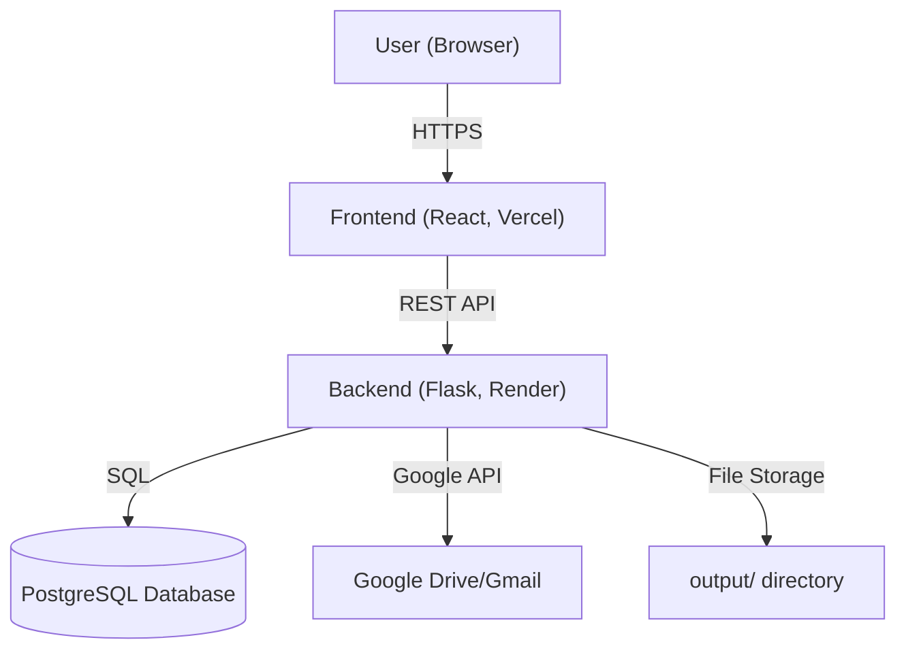

# Przetargi-Automatyzacja

> **Automated Tender Processing Platform**

## What is this project?
Przetargi-Automatyzacja is a full-stack system for automated collection, extraction, and management of public tender documents. It solves the problem of time-consuming manual review and organization of tenders by providing:
- Automated document fetching and extraction (PDF, DOCX, ZIP, etc.)
- AI-powered summary and text analysis
- Google Drive/Gmail integration
- Modern web interface for browsing, reviewing, and editing tenders

## What problem does it solve?
Manual tender management is slow, error-prone, and hard to scale. This project automates the process, making it faster, more reliable, and accessible from anywhere.

---

## 🚀 Live Demo
> **Note:** PostgreSQL database, cloud deployment (Render, Vercel), and public demo will be introduced in the future. For now, the prototype works locally using file/folder storage and local servers only.
>
> - **Frontend (Vercel):** _coming soon_
> - **Backend (Render):** _coming soon_

---

## 🗺️ Architecture Diagram

> **Current prototype:** Only the local file storage (`output/ directory`) is used. PostgreSQL and cloud services will be added later.

---

## 🛠️ Tech Stack


> **Note:** PostgreSQL, Render, and Vercel are planned for future releases. The current version works locally with file-based storage.

---

## 🏁 Local Setup

### 1. Backend (Python/Flask)
```bash
cd Przetargi-Automatyzacja
python3 -m venv venv
source venv/bin/activate  # On Windows: venv\Scripts\activate
pip install -r requirements.txt
# Add your .env file and Google API credentials as described in the backend README
python api.py
```

### 2. Frontend (React)
```bash
cd page
npm install
npm start
```
The frontend will be available at [http://localhost:3000](http://localhost:3000) and will proxy API requests to the backend at [http://localhost:5000](http://localhost:5000).

---

## 📚 Documentation
- [Backend details](Przetargi-Automatyzacja/README.md)
- [Frontend details](page/README.md)

Next feautures:

-postgreSQL integration
-render deploy
-email for tenders preparing for automated sending
-creating company profile
-automated profile matching
-past cyclical tenders for future work with them, for example every 3 years there is new przetarg for same tender
-calendar with future tenders

Bugs to be fixed:
-optimize row searching
-skip empty rows
-

## License
This project is licensed under the MIT License. 